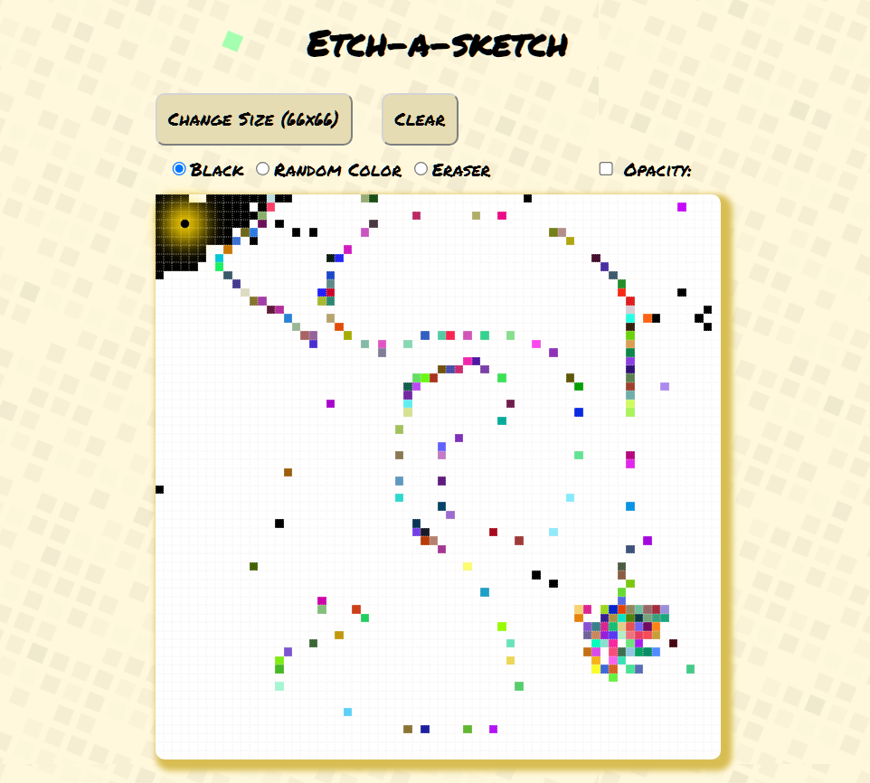

# Etch-a-Sketch App at The Odin Project

## Etch-A-Sketch App
This project is a web application that replicates the classic Etch-A-Sketch toy. It's designed to showcase skills in DOM manipulation, event listeners, functions, loops, and styling using HTML, CSS, and JavaScript. This project is part of The Odin Project Foundations course.

## Features
* **Dynamic Drawing Pad**: Users can draw on a dynamic grid, similar to traditional Etch-A-Sketch.
* **Color Modes**: Switch between drawing in black (default), random colors. There is an erase mode for erasing.
* **Opacity Control**: Adjust the opacity of drawings color mode.
* **Responsive Design**: Designed to work seamlessly across devices.

## How to Run
* Clone the repository to your local machine.
* Open the index.html file in your web browser.

## Usage
Upon opening the application, you'll find a drawing pad along with controls to change the drawing size, clear the canvas, and switch between different color modes. Use the drawing pad to create your masterpiece!

